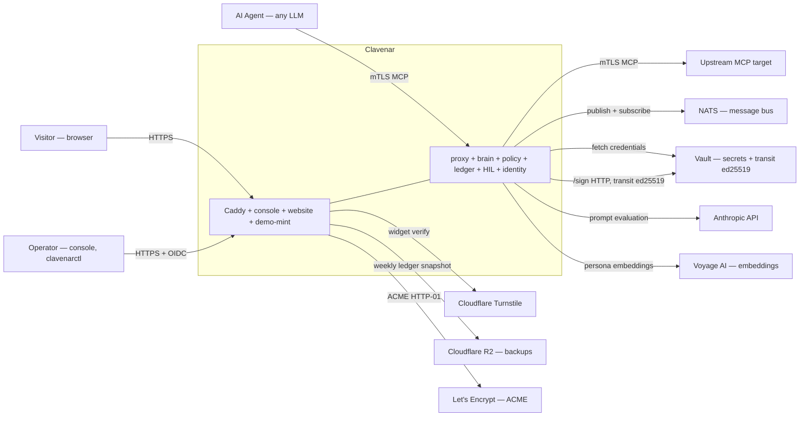
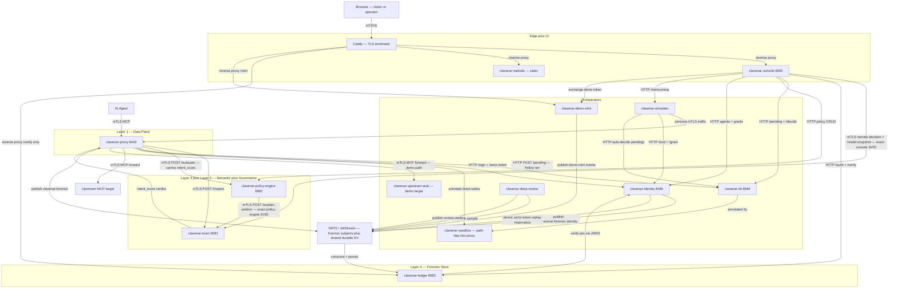
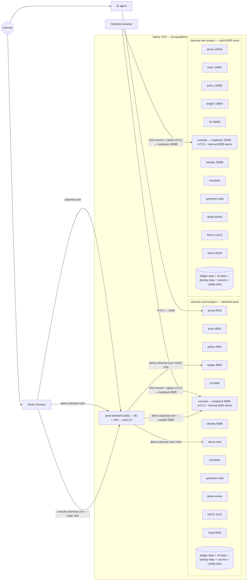
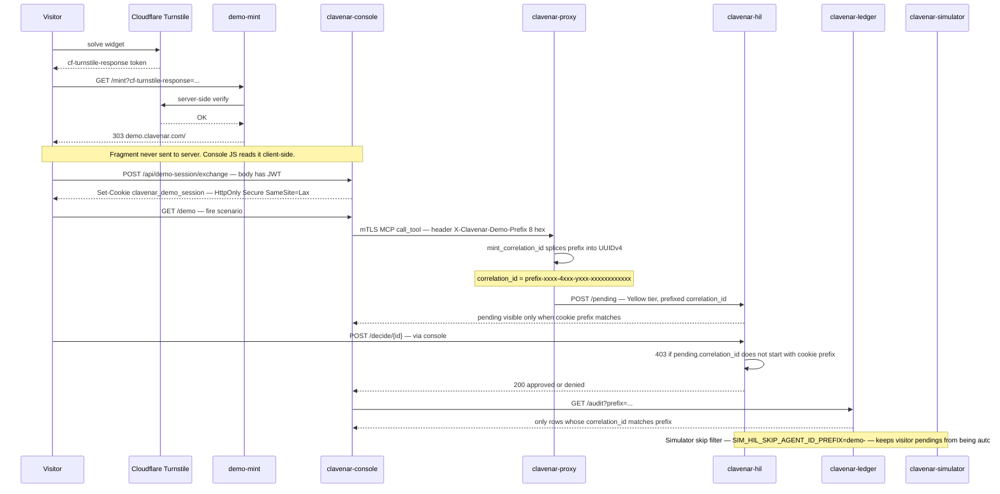
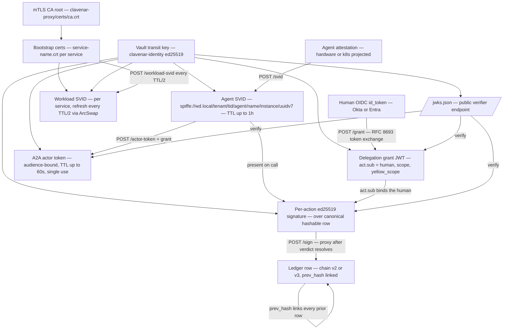

# Clavenar — architecture

System-wide architecture diagrams. The wire contracts behind every box and
arrow live in [`../TECH_SPEC.md`](../TECH_SPEC.md); this file is the
visual index. Five views, top-down by abstraction:

1. [System Context](#1-system-context) — who talks to Clavenar, and what
   external services Clavenar depends on.
2. [Container View](#2-container-view) — the four-layer hot path plus
   the orchestrators around it.
3. [Deployment Topology](#3-deployment-topology) — how `prod` and `dev`
   share a host-side Caddy.
4. [Demo-Prefix End-to-End](#4-demo-prefix-end-to-end) — visitor →
   token → cookie → correlation ID, the per-visitor isolation flow.
5. [Trust Chain](#5-trust-chain) — every credential Clavenar issues,
   from CA root down to the per-action ed25519 signature.

Per-repo behavior diagrams live in each service's own `docs/SEQUENCES.md`.

## 1. System Context

## 2. Container View

The four-layer hot path is serial: the proxy awaits Brain `/inspect`,
derives `intent_score` from that verdict, then calls Policy `/evaluate`
(`proxy → brain → policy`). The ledger row is written downstream over
the NATS forensic bus once the verdict resolves. Everything else is an
orchestrator hanging off the side: HIL gates Yellow-tier traffic,
identity roots the trust chain, sandbox annotates HIL pendings,
deep-review samples forensic rows.

## 3. Deployment Topology

Single VPS runs both `prod` (`clavenar-prod` compose project, standard
ports) and `dev` (`clavenar-dev`, +10000 offset). The production website/Caddy
service is the only browser edge; dev has no website vhost. The reserved
DEV/operator hostname `console.clavenar.com` is a static 404 during the
bootstrap phase. The native production `:8085` and dev `:18085` operator
listeners are host-loopback-only and require mTLS through an SSH tunnel.

## 4. Demo-Prefix End-to-End

How a visitor session gets its own correlation-ID namespace. The 8-hex
prefix is minted at Turnstile-time, ridden as a cookie, spliced into
every UUIDv4 the proxy emits, and used by HIL + ledger to gate reads
to the visitor's own traffic.

## 5. Trust Chain

Every credential Clavenar issues, top to bottom. The root is the mTLS
CA (`clavenar-proxy/certs/ca.crt`). The Vault transit key
`clavenar-identity` (ed25519) is the only signing key the rest of the
stack trusts; the `/jwks.json` endpoint on `clavenar-identity` is the
sole verifier.

