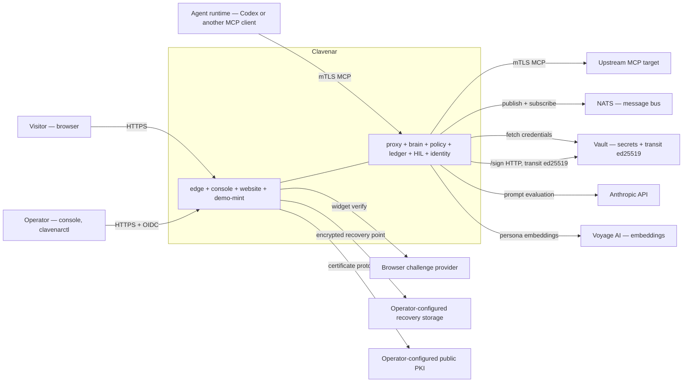
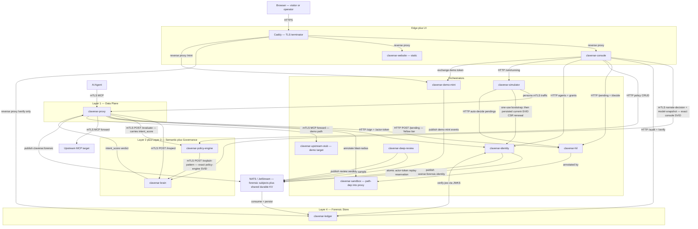
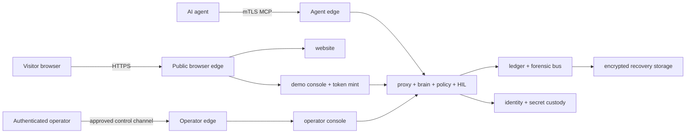
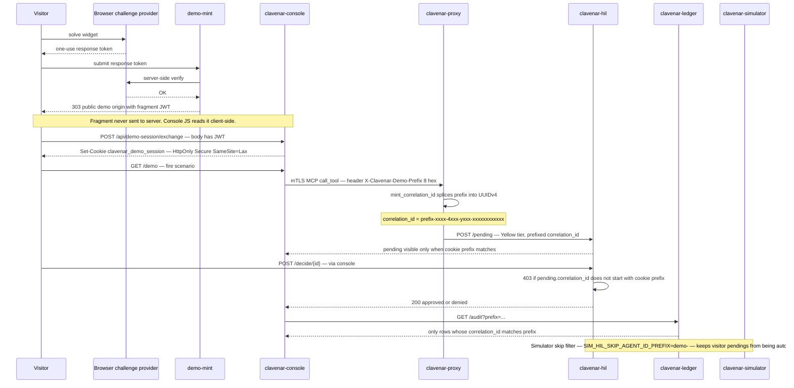
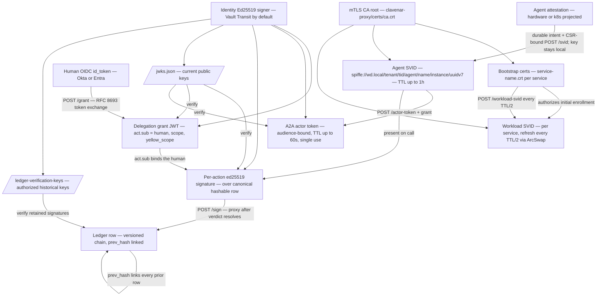

# Clavenar — architecture

This is the visual index for the system. The diagrams explain relationships;
[`TECH_SPEC.md`](../TECH_SPEC.md) and the machine-readable contracts define the
wire behavior behind every box and arrow.

| View | Question answered |
|---|---|
| [System context](#1-system-context) | Who calls Clavenar, and which external systems does it use? |
| [Container view](#2-container-view) | Which service owns each step in governed execution? |
| [Deployment boundary](#3-deployment-boundary) | Which public product roles exist without disclosing a live topology? |
| [Demo-prefix flow](#4-demo-prefix-end-to-end) | How is browser-demo traffic isolated by visitor? |
| [Trust chain](#5-trust-chain) | Which roots issue or verify each credential and evidence type? |

Per-repo behavior diagrams live in each service's own `docs/SEQUENCES.md`.

## 1. System Context

```mermaid
flowchart LR
  accTitle: Clavenar system context
  accDescr: Visitors, operators, and AI agents enter Clavenar through browser, operator, and mTLS interfaces; the platform reaches an upstream MCP target and its configured messaging, secret, model, challenge, recovery, and PKI dependencies.

  Visitor[Visitor — browser]
  Operator[Operator — console, clavenarctl]
  Agent[Agent runtime — Codex or another MCP client]
  Upstream[Upstream MCP target]

  subgraph Clavenar[Clavenar]
    direction TB
    Edge[edge + console + website + demo-mint]
    Core[proxy + brain + policy + ledger + HIL + identity]
  end

  NATS[NATS — message bus]
  Vault[Vault — secrets + transit ed25519]
  Anthropic[Anthropic API]
  Voyage[Voyage AI — embeddings]
  Challenge[Browser challenge provider]
  Recovery[Operator-configured recovery storage]
  PKI[Operator-configured public PKI]

  Visitor -->|HTTPS| Edge
  Operator -->|HTTPS + OIDC| Edge
  Agent -->|mTLS MCP| Core
  Core -->|mTLS MCP| Upstream

  Edge --- Core

  Core -->|publish + subscribe| NATS
  Core -->|fetch credentials| Vault
  Core -->|/sign HTTP, transit ed25519| Vault
  Core -->|prompt evaluation| Anthropic
  Core -->|persona embeddings| Voyage
  Edge -->|widget verify| Challenge
  Edge -->|encrypted recovery point| Recovery
  Edge -->|certificate protocol| PKI
```

## 2. Container View

The governed hot path is serial: Proxy awaits Brain `/inspect`, derives
`intent_score`, then calls Policy `/evaluate`. Once the verdict resolves, Proxy
publishes the forensic event for Ledger persistence. HIL gates Yellow-tier
traffic, Identity supplies credentials and signatures, Sandbox annotates HIL
pendings, and Deep Review samples forensic rows.

```mermaid
flowchart TD
  accTitle: Clavenar container view
  accDescr: The proxy runs the Brain and Policy security path before forwarding to an MCP target, coordinates HIL and Identity, publishes forensic events through NATS to Ledger and Deep Review, and exposes browser surfaces through the edge.

  Agent[AI Agent]
  Upstream[Upstream MCP target]
  Browser[Browser — visitor or operator]

  subgraph L1[Layer 1 — Data Plane]
    Proxy[clavenar-proxy]
  end

  subgraph L2L3[Layer 2 plus Layer 3 — Semantic plus Governance]
    Brain[clavenar-brain]
    Policy[clavenar-policy-engine]
  end

  subgraph L4[Layer 4 — Forensic Store]
    Ledger[clavenar-ledger]
  end

  Bus[NATS / JetStream — forensic subjects plus shared durable KV]

  subgraph Orch[Orchestrators]
    HIL[clavenar-hil]
    Identity[clavenar-identity]
    Sandbox[clavenar-sandbox — path-dep into proxy]
    DeepReview[clavenar-deep-review]
    DemoMint[clavenar-demo-mint]
    Simulator[clavenar-simulator]
    UpstreamStub[clavenar-upstream-stub — demo target]
  end

  subgraph Edge[Edge plus UI]
    Caddy[Caddy — TLS terminator]
    Console[clavenar-console]
    Website[clavenar-website — static]
  end

  Agent -->|mTLS MCP| Proxy
  Proxy -->|mTLS POST /inspect| Brain
  Brain -->|intent_score verdict| Proxy
  Proxy -->|mTLS POST /evaluate — carries intent_score| Policy
  Policy -->|mTLS POST /explain-pattern — exact policy-engine SVID| Brain
  Console -->|mTLS narrate-decision + model-snapshot — exact console SVID| Brain
  Proxy -->|HTTP POST /pending — Yellow tier| HIL
  Proxy -->|HTTP /sign + /actor-token| Identity
  Proxy -->|annotate blast-radius| Sandbox
  Proxy -->|mTLS MCP forward| Upstream
  Proxy -->|mTLS MCP forward — demo path| UpstreamStub
  Proxy -->|publish clavenar.forensic| Bus

  Bus -->|consume + persist| Ledger
  Ledger -->|verify-jws via JWKS| Identity
  Identity -->|publish clavenar.forensic.identity| Bus
  Identity -->|atomic actor-token replay reservation| Bus

  HIL -->|annotated by| Sandbox
  DeepReview -->|consume sample| Bus
  DeepReview -->|publish review verdict| Bus

  Simulator -->|persona mTLS traffic| Proxy
  Simulator -->|one-use bootstrap; then persisted current-SVID CSR renewal| Identity
  Simulator -->|HTTP auto-decide pendings| HIL

  Browser -->|HTTPS| Caddy
  Caddy -->|reverse proxy| Console
  Caddy -->|reverse proxy| Website
  Caddy -->|reverse proxy /verify only| Ledger
  Caddy -->|reverse proxy /mint| DemoMint

  Console -->|HTTP /audit + /verify| Ledger
  Console -->|HTTP /pending + /decide| HIL
  Console -->|HTTP policy CRUD| Policy
  Console -->|HTTP agents + grants| Identity
  Console -->|HTTP /sim/running| Simulator
  Console -->|exchange demo token| DemoMint

  DemoMint -->|publish demo-mint events| Bus
```

## 3. Deployment Boundary

This is sanitized product architecture. Public entry points are interfaces,
not a topology disclosure. A deployment presents a browser edge, an
agent-facing mTLS edge, operator-authenticated control surfaces, application
roles, durable state, secret custody, and recovery storage. The portable
Compose and chart contracts describe supported role wiring without asserting a
live host map.

Deployment-specific operating procedures are maintained privately: host and
provider placement, region, environment co-location, internal and reserved
hostnames, listener and service-port maps, perimeter and DNS rules, backup
destination and lifecycle, destructive reset procedures, and operator access.

```mermaid
flowchart LR
  accTitle: Sanitized deployment boundary
  accDescr: Browser, operator, and agent edges route into website, demo, console, and the governed request pipeline, which depends on evidence storage, identity and secret custody, and encrypted recovery storage.

  Browser[Visitor browser] -->|HTTPS| PublicEdge[Public browser edge]
  Operator[Authenticated operator] -->|approved control channel| OperatorEdge[Operator edge]
  Agent[AI agent] -->|mTLS MCP| AgentEdge[Agent edge]

  PublicEdge --> Website[website]
  PublicEdge --> Demo[demo console + token mint]
  OperatorEdge --> Console[operator console]
  AgentEdge --> Pipeline[proxy + brain + policy + HIL]

  Demo --> Pipeline
  Console --> Pipeline
  Pipeline --> Evidence[ledger + forensic bus]
  Pipeline --> Identity[identity + secret custody]
  Evidence --> Recovery[encrypted recovery storage]
```

## 4. Demo-Prefix End-to-End

How a visitor session gets its own correlation-ID namespace. The 8-hex
prefix is minted after challenge verification, ridden as a cookie, spliced into
every UUIDv4 the proxy emits, and used by HIL + ledger to gate reads
to the visitor's own traffic.

```mermaid
sequenceDiagram
  accTitle: Demo-prefix end-to-end flow
  accDescr: A visitor solves a browser challenge, exchanges a one-use token for an isolated demo session, fires a scenario through the proxy and HIL, and reads only ledger rows bearing the session's correlation prefix.

  participant Visitor
  participant Challenge as Browser challenge provider
  participant Mint as demo-mint
  participant Console as clavenar-console
  participant Proxy as clavenar-proxy
  participant HIL as clavenar-hil
  participant Ledger as clavenar-ledger
  participant Sim as clavenar-simulator

  Visitor->>Challenge: solve widget
  Challenge-->>Visitor: one-use response token
  Visitor->>Mint: submit response token
  Mint->>Challenge: server-side verify
  Challenge-->>Mint: OK
  Mint-->>Visitor: 303 public demo origin with fragment JWT
  Note over Visitor,Console: Fragment never sent to server. Console JS reads it client-side.
  Visitor->>Console: POST /api/demo-session/exchange — body has JWT
  Console-->>Visitor: Set-Cookie clavenar_demo_session — HttpOnly Secure SameSite=Lax
  Visitor->>Console: GET /demo — fire scenario
  Console->>Proxy: mTLS MCP call_tool — header X-Clavenar-Demo-Prefix 8 hex
  Proxy->>Proxy: mint_correlation_id splices prefix into UUIDv4
  Note over Proxy: correlation_id = prefix-xxxx-4xxx-yxxx-xxxxxxxxxxxx
  Proxy->>HIL: POST /pending — Yellow tier, prefixed correlation_id
  HIL-->>Console: pending visible only when cookie prefix matches
  Visitor->>HIL: POST /decide/{id} — via console
  HIL->>HIL: 403 if pending.correlation_id does not start with cookie prefix
  HIL-->>Console: 200 approved or denied
  Console->>Ledger: GET /audit?prefix=...
  Ledger-->>Console: only rows whose correlation_id matches prefix
  Note over Sim,HIL: Simulator skip filter — SIM_HIL_SKIP_AGENT_ID_PREFIX=demo- — keeps visitor pendings from being auto-decided
```

## 5. Trust Chain

The trust chain has two distinct roots. The deployment CA signs bootstrap,
agent, and workload certificates. Identity's Ed25519 signer—Vault Transit by
default—signs grants, actor tokens, and finalized actions. Identity publishes
current public keys through `/jwks.json`; Ledger obtains the authorized,
bounded historical key set through workload-mTLS
`/ledger-verification-keys`. Private keys remain with their owner or signing
backend.

```mermaid
flowchart TD
  accTitle: Clavenar credential trust chain
  accDescr: The deployment CA signs bootstrap certificates and agent or workload SVIDs, while the Identity Ed25519 backend signs delegation grants, actor tokens, and finalized actions; current and historical public-key endpoints support verification of the resulting ledger chain.

  CA[mTLS CA root — clavenar-proxy/certs/ca.crt]
  Signer[Identity Ed25519 signer — Vault Transit by default]

  Bootstrap[Bootstrap certs — service-name.crt per service]
  AgentAttest[Agent attestation — hardware or k8s projected]
  HumanOIDC[Human OIDC id_token — Okta or Entra]

  SVID[Agent SVID — spiffe://wd.local/tenant/tid/agent/name/instance/uuidv7 — TTL up to 1h]
  Grant[Delegation grant JWT — act.sub = human, scope, yellow_scope]
  ActorToken[A2A actor token — audience-bound, TTL up to 60s, single use]
  WorkloadSVID[Workload SVID — per service, refresh every TTL/2 via ArcSwap]
  Sign[Per-action ed25519 signature — over canonical hashable row]
  LedgerRow[Ledger row — versioned chain, prev_hash linked]

  JWKS[/jwks.json — current public keys/]
  HistoryKeys[/ledger-verification-keys — authorized historical keys/]

  CA --> Bootstrap
  CA --> SVID
  CA --> WorkloadSVID
  Bootstrap -->|authorizes initial enrollment| WorkloadSVID
  Signer --> Grant
  Signer --> ActorToken
  Signer --> Sign

  AgentAttest -->|durable intent + CSR-bound POST /svid; key stays local| SVID
  HumanOIDC -->|POST /grant — RFC 8693 token exchange| Grant
  SVID -->|POST /actor-token + grant| ActorToken
  Bootstrap -->|POST /workload-svid every TTL/2| WorkloadSVID

  SVID -->|present on call| Sign
  Grant -->|act.sub binds the human| Sign
  Sign -->|POST /sign — proxy after verdict resolves| LedgerRow
  LedgerRow -->|prev_hash links every prior row| LedgerRow

  Signer --> JWKS
  Signer --> HistoryKeys
  JWKS -->|verify| Sign
  JWKS -->|verify| Grant
  JWKS -->|verify| ActorToken
  HistoryKeys -->|verify retained signatures| LedgerRow
```
